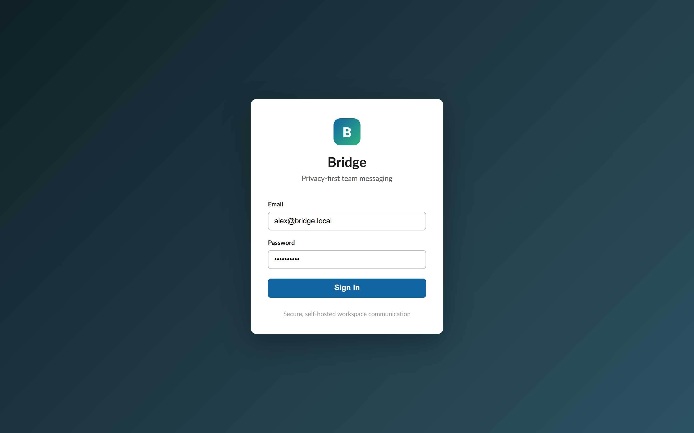
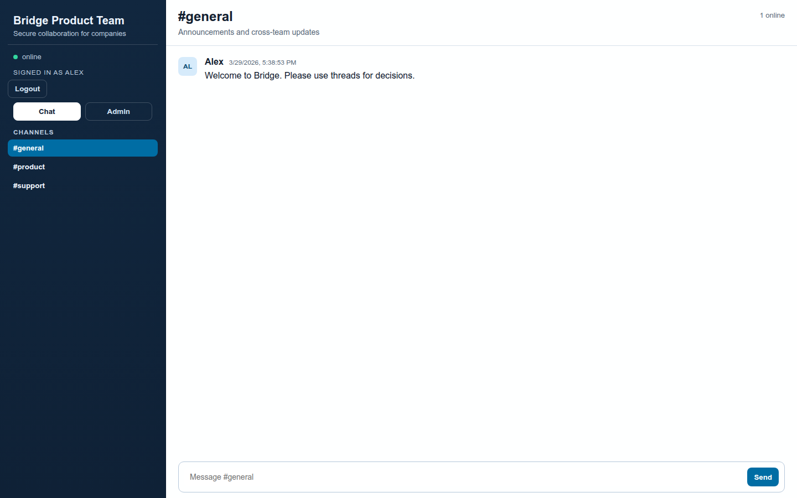
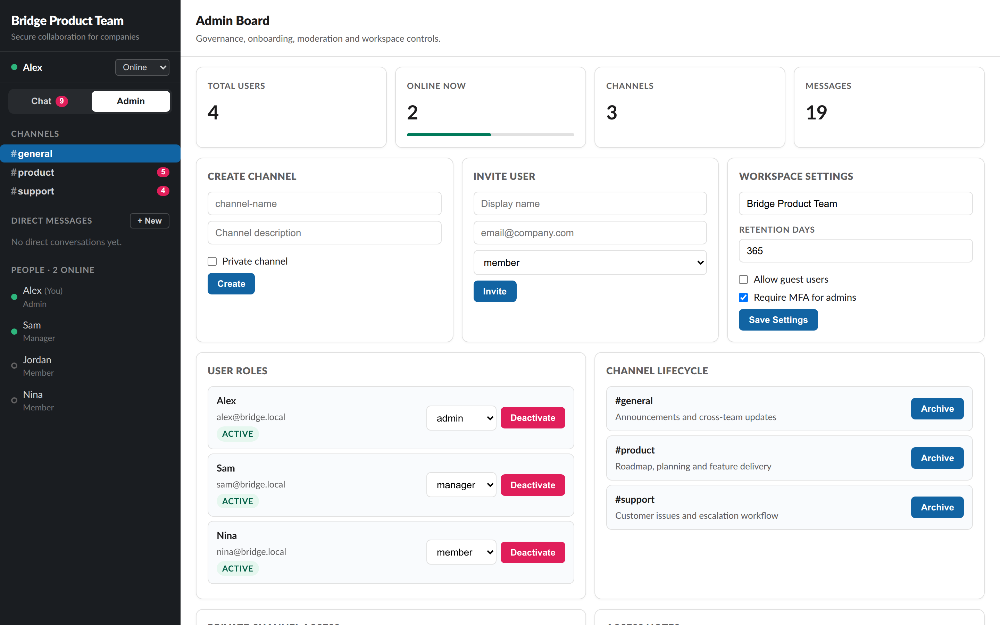

# Bridge

Bridge is a privacy-first team messaging platform with real-time sync, workspace governance controls, and an integrated admin board.

## Project Status & Disclaimer

Bridge is a self-teaching side project and community playground, not a finished enterprise product.

- This repository is provided as-is for learning and experimentation.
- No warranty is provided, including for security vulnerabilities, data loss, or fitness for production use.
- Do not deploy this code in production environments without your own full security review, hardening, and operational controls.

## Screenshots

Screenshots below were refreshed for the current session-based login flow.

### Login



### Chat Workspace



### Admin Board



The Admin Board includes workspace governance, security controls, and bot lifecycle management (for example guest access, MFA enforcement policy toggles, and bot token rotation/revocation).

## Stack

- TypeScript monorepo (`npm` workspaces)
- `apps/server`: Fastify + WebSocket real-time sync API
- `apps/web`: React + Vite client
- `apps/desktop`: Electron shell that loads the web app in a hardened window
- `apps/mobile`: Expo / React Native shell for mobile auth and chat browsing
- `packages/shared`: shared event/types contracts
- Docker Compose for local Postgres + Redis dependencies
- Git metadata stamping in builds and runtime

## Product Scope

- Multi-channel company chat with realtime message delivery
- Presence status and online member indicator
- Admin board for:
  - onboarding/invite users
  - role management (`admin`, `manager`, `member`, `guest`)
  - bot provisioning, token issuance, rotation and revocation
  - channel lifecycle management (create/archive)
  - workspace security/governance settings
  - message moderation and audit log

## Quick start

1. Install dependencies:
   ```bash
   npm install
   ```
2. Copy env files:
   ```bash
   cp apps/server/.env.example apps/server/.env
   cp apps/web/.env.example apps/web/.env
   cp apps/mobile/.env.example apps/mobile/.env
   ```
3. Start infra (optional for current in-memory MVP):
   ```bash
   docker compose up -d
   ```
4. Run DB migrations:
   ```bash
   npm run db:migrate -w @bridge/server
   ```
5. Run both apps:
   ```bash
   npm run dev
   ```
6. Optional desktop shell:
   ```bash
   npm run dev:desktop
   ```
7. Optional mobile shell:
   ```bash
   npm run dev:mobile
   ```

- Web: http://localhost:5173
- API: http://localhost:4000
- Web now uses session login (`/auth/login`) before entering the workspace
- Desktop shell loads `BRIDGE_DESKTOP_URL` or defaults to `http://localhost:5173`
- Mobile shell reads `API_URL` and `WS_URL` from `apps/mobile/.env` or shell environment variables

## Desktop Shell

Bridge includes a minimal Electron shell in `apps/desktop`.

- It uses a secure `BrowserWindow` configuration.
- It loads the same Bridge web app/backend as the browser client.
- Set `BRIDGE_DESKTOP_URL` to point it at a different web deployment if needed.

Run it with:

```bash
npm run dev:desktop
```

## Mobile Shell

Bridge includes a minimal Expo shell in `apps/mobile`.

- It handles session login against `POST /auth/login`.
- It loads the current workspace via `GET /bootstrap`.
- It renders a basic channel list and the messages for the selected channel.
- `apps/mobile/.env.example` documents the `API_URL` and `WS_URL` variables.
- For Android emulators, point `API_URL` at `http://10.0.2.2:4000` instead of `http://localhost:4000`.

Run it with:

```bash
npm run dev:mobile
```

### Server environment

- `DATABASE_URL` points to Postgres (for migrations and upcoming persistent storage)
- `REDIS_URL` configures Redis-backed websocket pub/sub, presence fanout, and reachability checks
- `STORE_DRIVER=postgres` enables persistent storage; use `memory` for local test-only mode
- `RUN_MIGRATIONS_ON_BOOT=true` applies migrations on server startup in Postgres mode
- `AUTH_LOGIN_RATE_LIMIT_MAX` and `AUTH_LOGIN_RATE_LIMIT_WINDOW_MS` tune login burst throttling
- `AUTH_LOGIN_FAILURE_LIMIT_MAX` and `AUTH_LOGIN_FAILURE_LIMIT_WINDOW_MS` tune login brute-force lockout
- `API_RATE_LIMIT_MAX` and `API_RATE_LIMIT_WINDOW_MS` tune authenticated API throttling
- `AUTH_MODE` supports `local` (password login) and `oidc` (header-based SSO proxy flow)
- `SESSION_COOKIE_SECURE=true` should be enabled behind HTTPS in production
- `SESSION_COOKIE_SAMESITE` supports `lax` (default), `strict`, or `none`
- `SESSION_COOKIE_DOMAIN` can scope cookies to your production domain
- `TRUST_PROXY_HEADERS=true` enables `x-forwarded-for` client IP extraction behind trusted proxies
- `ATTACHMENT_STORAGE_DRIVER` supports `local` (default), `s3`, or `webdav`
- `ATTACHMENT_LOCAL_DIR` sets local upload directory for `local` driver
- `ATTACHMENT_MAX_SIZE_BYTES` sets max upload size in bytes
- `ATTACHMENT_ENCRYPTION_PRIMARY_KEY` enables at-rest encryption for attachments when set; provide a 32-byte key as hex or base64
- `ATTACHMENT_ENCRYPTION_PRIMARY_KEY_ID` labels the primary encryption key in the envelope metadata; defaults to `primary`
- `ATTACHMENT_ENCRYPTION_FALLBACK_KEYS` is a comma-separated list of `keyId=key` entries used to decrypt older attachments
- `ATTACHMENT_ENCRYPTION_KEY` remains accepted as a legacy single-key alias for backwards compatibility
- `ATTACHMENT_SCAN_MODE` supports `none` (default) or `command`
- `ATTACHMENT_SCAN_COMMAND` is required for `ATTACHMENT_SCAN_MODE=command` and must include `{file}` placeholder (example: `clamscan --no-summary {file}`)
- `ATTACHMENT_SCAN_TIMEOUT_MS` controls scanner command timeout
- `ATTACHMENT_BLOCKED_EXTENSIONS` overrides blocked executable/script extensions
- For `ATTACHMENT_STORAGE_DRIVER=s3`, configure `ATTACHMENT_S3_BUCKET`, `ATTACHMENT_S3_REGION`, optional `ATTACHMENT_S3_ENDPOINT`, `ATTACHMENT_S3_KEY_PREFIX`, `ATTACHMENT_S3_FORCE_PATH_STYLE`, `ATTACHMENT_S3_ACCESS_KEY_ID`, and `ATTACHMENT_S3_SECRET_ACCESS_KEY`
- For `ATTACHMENT_STORAGE_DRIVER=webdav`, configure `ATTACHMENT_WEBDAV_BASE_URL`, `ATTACHMENT_WEBDAV_USERNAME`, `ATTACHMENT_WEBDAV_APP_PASSWORD`, and optional `ATTACHMENT_WEBDAV_PATH_PREFIX`
- Use a Nextcloud app password for `ATTACHMENT_WEBDAV_APP_PASSWORD`, not the primary account password
- In `AUTH_MODE=oidc`, configure identity headers with `OIDC_EMAIL_HEADER`, `OIDC_DISPLAY_NAME_HEADER`, and `OIDC_GROUPS_HEADER`
- Optional OIDC group-to-role mapping via `OIDC_ROLE_GROUP_ADMIN`, `OIDC_ROLE_GROUP_MANAGER`, `OIDC_ROLE_GROUP_MEMBER`, `OIDC_ROLE_GROUP_GUEST`

## Admin API

Admin endpoints are protected by role and require a valid session cookie.

- `GET /admin/overview`
- `GET /admin/audit/export?format=json|csv&action=&actorId=&since=&until=&offset=&limit=`
- `POST /admin/channels`
- `PATCH /admin/channels/:channelId`
- `POST /admin/channels/:channelId/members`
- `DELETE /admin/channels/:channelId/members/:userId`
- `POST /admin/users`
- `GET /admin/bots`
- `POST /admin/bots` creates an API-capable bot user and returns a one-time bearer token
- `POST /admin/bots/:botUserId/token` rotates a bot token and returns a new one-time bearer token
- `DELETE /admin/bots/:botUserId/token` revokes active bot tokens
- `PATCH /admin/users/:userId/role`
- `PATCH /admin/users/:userId/status`
- `PATCH /admin/settings`
- `PATCH /admin/settings` can update governance/security settings such as `allowGuestAccess` and `enforceMfaForAdmins`
- `POST /admin/maintenance/retention-run` executes a retention sweep based on `messageRetentionDays`
- `DELETE /admin/messages/:messageId`

## Auth API

- `POST /auth/login` with `{ email, password }`
- `POST /auth/oidc/login` (only when `AUTH_MODE=oidc`; identity from trusted proxy headers)
- `GET /auth/me`
- `GET /auth/mode`
- `POST /auth/logout`
- `POST /bots/messages` posts as a bot using `Authorization: Bearer <token>`

## Notifications API

- `GET /notifications?limit=20&offset=0&unreadOnly=false` (session required)
- `POST /notifications/read` with `{ all?: boolean, notificationIds?: string[] }` (session required)
- `GET /notifications/preferences` (session required)
- `PATCH /notifications/preferences` with `{ mentionEnabled?, directMessageEnabled? }` (session required)
- Notifications currently cover in-app mention and direct-message activity only; push delivery is still an open follow-up

## Readiness API

- `GET /ready` returns dependency readiness for store and Redis with `200` when ready and `503` when required dependencies are unhealthy
- API responses echo `x-request-id` when the header is supplied, which makes request tracing easier across client and server logs

## Metrics API

- `GET /metrics` exposes Prometheus-compatible counters for HTTP/auth/rate-limit events

## Search API

- `GET /search/messages?q=<term>&channelId=&fromUserId=&before=&after=&offset=0&limit=20` (session required)
- `before` and `after` accept ISO 8601 timestamps
- Response metadata includes `count`, `total`, `offset`, `limit`, `nextOffset`, and `hasMore`

## Attachments API

- `POST /attachments` multipart upload (`file`, `channelId`, optional `threadRootMessageId`)
- `DELETE /attachments/:attachmentId` removes pending upload (owner-only)
- `GET /attachments/:attachmentId/download` downloads a linked attachment with ACL checks
- `ATTACHMENT_STORAGE_DRIVER=webdav` is Nextcloud-compatible through WebDAV `PUT`/`GET`/`DELETE`

## Unread API

- `GET /me/unread` (session required)

## Direct Message API

- `GET /dm/conversations` (session required)
- `POST /dm/conversations` with `{ participantUserIds: string[] }` (session required)

## Bootstrap API

- `GET /bootstrap` (session required; channels/messages are ACL-filtered per user)

Default local dev credentials:

- `alex@bridge.local` / `bridge123!`
- `sam@bridge.local` / `bridge123!`
- `nina@bridge.local` / `bridge123!`

## Current Status

Implemented:

- Session login/logout (`/auth/*`) with cookie-based auth
- Auth mode switch (`AUTH_MODE=local|oidc`) with OIDC login route (`POST /auth/oidc/login`)
- Admin board role checks and moderation flows
- Admin audit export with filtering/pagination (`GET /admin/audit/export?...`)
- Channel membership/ACL controls for private channels
- Direct messages and group direct message conversations
- Threads/replies with `threadRootMessageId` metadata
- Mentions metadata extraction on message send (`mentionUserIds`)
- Attachment uploads with pending queue, message binding, ACL-protected download, and retention/moderation cleanup
- Optional AES-256-GCM at-rest encryption for attachment payloads via primary/fallback rotation keys
- Bot users with one-time API tokens, bearer-authenticated bot message posting, and admin token rotation/revocation
- Notification foundation for mention and direct-message activity, with read/unread tracking and user preferences
- Minimal Electron desktop shell for the existing web app
- Minimal Expo mobile shell for auth/bootstrap/channel browsing
- Unread counters endpoint and server-side read-state tracking (`GET /me/unread`)
- Auth/API boundary rate limiting and brute-force protections (`429` + `retry-after`)
- Optional Postgres-backed persistence (`STORE_DRIVER=postgres`)
- Database migrations (`001_init.sql`, `002_auth.sql`, `003_channel_acl.sql`, `004_direct_messages.sql`, `005_threads_mentions.sql`, `006_attachments.sql`, `007_bot_users.sql`, `008_notifications.sql`)
- Realtime WebSocket sync with authenticated user binding
- Paginated/filterable message search endpoint with ACL-safe filtering
- Readiness endpoint with store/Redis dependency checks (`GET /ready`)
- Request correlation IDs echoed back on HTTP responses via `x-request-id`
- Prometheus-compatible metrics endpoint (`GET /metrics`)
- Manual retention maintenance endpoint with audit trail (`POST /admin/maintenance/retention-run`)

### Recently Delivered (2026-04-01)

- OIDC mode wiring (`/auth/mode`, `/auth/oidc/login`) plus security/session hardening updates
- `/ready` now reports real store + Redis health instead of Redis placeholder status
- Redis-backed realtime coordination for websocket message broadcast, typing, and presence when `REDIS_URL` is set
- Audit export now supports JSON/CSV plus filters (`action`, `actorId`, `since`, `until`) and pagination (`offset`, `limit`)
- `/metrics` added with in-process HTTP/auth/rate-limit counters
- Search v2 added with pagination metadata and filters (`channelId`, `fromUserId`, `before`, `after`, `offset`, `limit`)
- Retention sweep operation added for admin maintenance
- Notification foundation shipped:
  - mention and direct-message notification records
  - authenticated list/read APIs for notifications
  - notification preference storage and update API
- Attachment v1 shipped:
  - message attachments in shared contracts/bootstrap payloads
  - upload endpoint with size and extension policy enforcement
  - optional AES-256-GCM at-rest encryption for attachment payloads via primary/fallback rotation keys
  - optional scanner hook (`ATTACHMENT_SCAN_MODE=command`) for AV command integration
  - local and S3-compatible storage drivers
  - Nextcloud-compatible WebDAV storage driver
  - attachment download endpoint with channel ACL checks
  - pending upload removal endpoint
  - attachment cleanup on moderation deletes and retention sweeps
- Bot API shipped:
  - `POST /admin/bots` provisions a bot user and returns a one-time bearer token
  - `POST /bots/messages` lets bots post into channels with normal ACL checks
  - bot access tokens are stored hashed in the database
  - `GET /admin/bots` lists bot users with active token summaries
  - `POST /admin/bots/:botUserId/token` rotates a bot token and shows the new value once
  - `DELETE /admin/bots/:botUserId/token` revokes active bot tokens
- Desktop shell shipped:
  - Electron host app in `apps/desktop`
  - secure `BrowserWindow` defaults
  - configurable target URL via `BRIDGE_DESKTOP_URL`
- Mobile shell shipped:
  - Expo host app in `apps/mobile`
  - session login, bootstrap loading, channel list, and message list shell
  - configurable backend URLs via `API_URL` and `WS_URL`

## Open Work

Still required for production replacement:

- Better search (indexing quality, ranking, pagination, retention awareness)
- Observability expansion beyond counters (`/metrics` exists): tracing, log correlation, dashboards, alert routing
- Backup/restore automation with restore verification in CI/staging
- Mattermost migration tooling (users/channels and optional history)
- Mobile native features, desktop native features, and push notification delivery strategy
- Scanner hardening for attachments (production ClamAV deployment pattern, health checks, and signature update runbook)
- Nextcloud/WebDAV production hardening notes and credentials rotation guidance for attachment storage
- Secret-manager-backed key source and automated re-encryption tooling for attachment encryption

## Validation Pipeline

Run all local checks:

```bash
npm run lint
npm run test
npm run smoke
```

## Git in build process

Builds are stamped with:

- commit SHA
- branch name
- latest tag (if available)
- dirty state
- build timestamp

Use:

```bash
npm run build
```

This generates `build-meta.json` in each app `dist` folder and exposes metadata via `GET /health` on the server.

## Privacy defaults

- No third-party analytics
- Minimal log data
- CORS allow-list from environment
- Private workspaces/users modeled server-side
- Architecture leaves room for end-to-end encryption later
