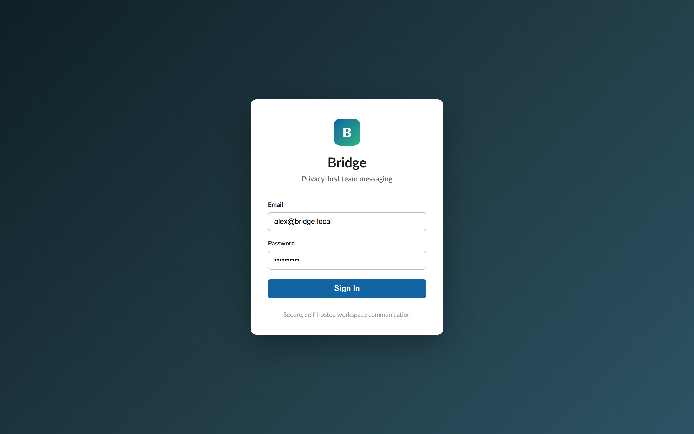
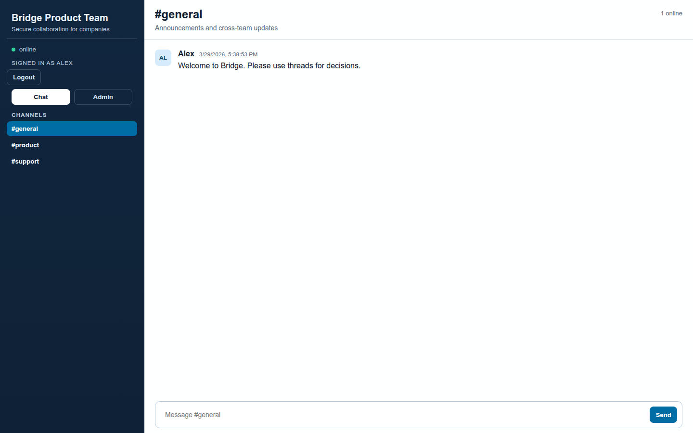
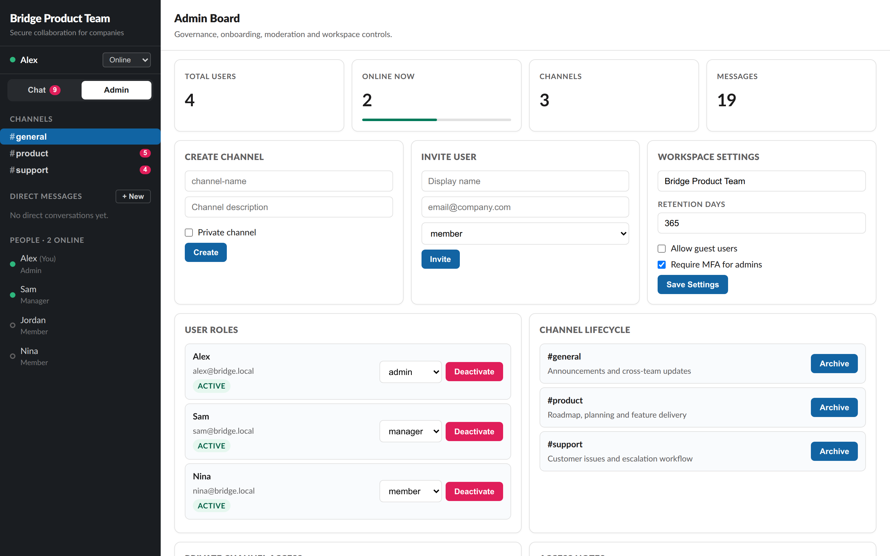

# Bridge

Bridge is a multi-client team messaging platform with a Fastify API, realtime WebSocket sync, role-based administration, attachment handling, notifications, and optional desktop and mobile shells.

## Documentation

Operational and engineering documentation now lives under [`docs/`](docs/README.md).

- [Documentation Index](docs/README.md)
- [Platform Overview](docs/overview.md)
- [Architecture](docs/architecture.md)
- [Installation](docs/installation.md)
- [Configuration Reference](docs/configuration.md)
- [Deployment Guide](docs/deployment.md)
- [Operations Guide](docs/operations.md)
- [Security Guide](docs/security.md)
- [Admin Guide](docs/admin-guide.md)
- [API Reference](docs/api-reference.md)
- [Troubleshooting](docs/troubleshooting.md)

## Quick Start

1. Install workspace dependencies:
   ```bash
   npm install
   ```
2. Copy example environment files:
   ```bash
   cp apps/server/.env.example apps/server/.env
   cp apps/web/.env.example apps/web/.env
   cp apps/mobile/.env.example apps/mobile/.env
   ```
3. Start local infrastructure:
   ```bash
   docker compose up -d
   ```
4. Apply database migrations:
   ```bash
   npm run db:migrate -w @bridge/server
   ```
5. Start the API and web client:
   ```bash
   npm run dev
   ```

Optional clients:

- Desktop shell:
  ```bash
  npm run dev:desktop
  ```
- Mobile shell:
  ```bash
  npm run dev:mobile
  ```

Default local endpoints:

- Web: `http://localhost:5173`
- API: `http://localhost:4000`
- Postgres: `127.0.0.1:5432`
- Redis: `127.0.0.1:6379`

Default local accounts:

- `alex@bridge.local` / `bridge123!` (`admin`)
- `sam@bridge.local` / `bridge123!` (`manager`)
- `nina@bridge.local` / `bridge123!` (`member`)
- `jordan@bridge.local` / `bridge123!` (`member`)

## Repository Layout

| Path | Purpose |
| --- | --- |
| `apps/server` | Fastify API, WebSocket server, migrations, auth, notifications, attachment storage |
| `apps/web` | React and Vite browser client, including the chat workspace and admin board |
| `apps/desktop` | Electron shell that hosts the web client in a hardened desktop window |
| `apps/mobile` | Expo / React Native shell for login, channel browsing, unread counts, and notifications |
| `packages/shared` | Shared contracts for users, channels, messages, notifications, workspace state, and realtime events |
| `scripts` | Build metadata generation, smoke validation, screenshots |
| `docs` | Operator and engineering documentation |

## Screenshots

### Login



### Chat Workspace



### Admin Board


